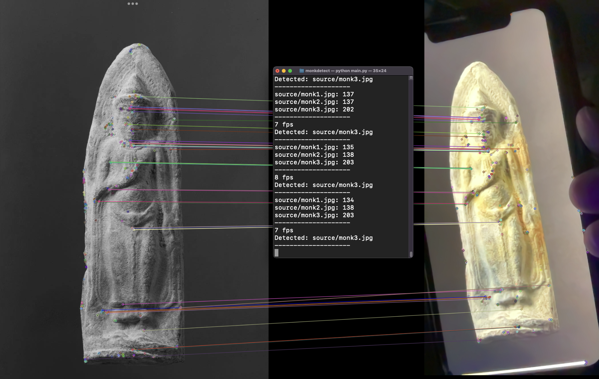

# monkdetect
Detects/classify images of Buddha amulet with OpenCV. Because my friend messed up.<br />
<br />
bro1: We printed 700 images that we need to put in correct order.<br />
bro1: They swapped all the orders.<br />
bro2: ...<br />
bro2: just play ded<br />

Install miniconda: https://docs.conda.io/en/latest/miniconda.html<br />

```
conda create --name monkdetect python=3.9.7
conda activate monkdetect
pip install -r requirements.txt
python main.py
```
Put your monk images in /source<br />
Start the program<br />
Point your webcam to the image<br />
The correct image will have the highest score (it's sorted)<br />
*** no need to quit the program the score is an average of last 10 cycles<br />
press Q to close the program<br />
## disclaimer
i dunno wut im doing lul<br />
<br />
## disclaimer2
probably can be super quicker, and do in batches, but that's for another day.<br />
## disclaimer3
acutally does not detect monks. It detects if webcam source has something similar to files in source/, then spits out the name of the file.<br />
in this case, we use it to get the file name of printed images of amulet.<br />
## optimization opportunity
currently monkdetect only uses one CPU core
use ZMQ to spawn orb.detectAndCompute PID should improve performance
