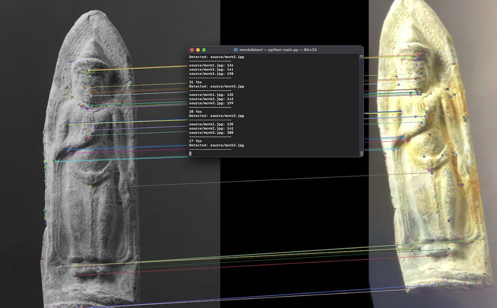

# monkdetect
Detects/classify images of Buddha amulet with OpenCV. Because my friend messed up.

bro1: We printed 700 images that we need to put in correct order.
bro1: They swapped all the orders.
bro2: ...
bro2: just play ded

Install miniconda: https://docs.conda.io/en/latest/miniconda.html

```
conda create --name monkdetect python=3.9.7
conda activate monkdetect
pip install -r requirements.txt
python main.py
```
Put your monk images in /source
Start the program
Point your webcam to the image
The correct image will have the highest score (it's sorted)
*** no need to quit the program the score is an average of last 10 cycles
press Q to close the program
# disclaimer
i dunno wut im doing lul

# disclaimer2
probably can be super quicker, and do in batches, but that's for another day.
